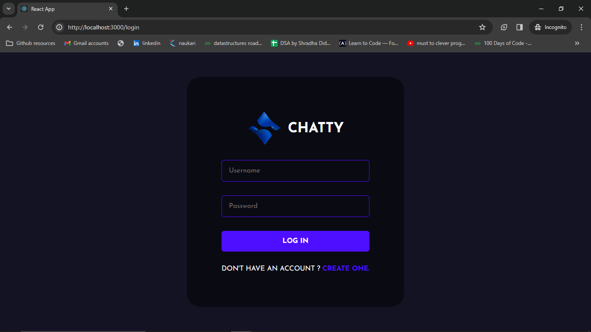
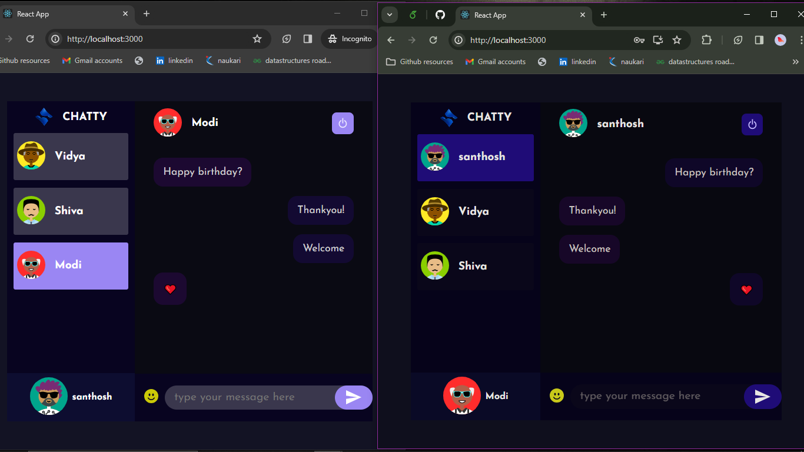

# chatty
Chatty Full stack chat application built using MERN stack and Socket.io. Using this website users can register and  communicate seamlessly with each other in relatime. The chat data and users registered are retained in mongodb database and fetched the chats when user logs in from any machine.  

# Chatty- Chat Application

Chatty is chat application build with the power of MERN Stack and Socket.io.





## Installation Guide

### Requirements

- [Nodejs](https://nodejs.org/en/download)
- [Mongodb](https://www.mongodb.com/docs/manual/administration/install-community/)

Both should be installed and make sure mongodb is running.

```shell
git clone https://github.com/hvsanthosh/chatty.git
cd chatty-app-react-nodejs
```

add Mongo url in server .env file, rest all is set to go!

Now install the dependencies

```shell
cd server
npm i
cd ..
cd public
npm i
```

We are almost done, Now just start the development server.

For Frontend.

```shell
cd public
npm start
```

For Backend.

Open another terminal in folder, Also make sure mongodb is running in background.

```shell
cd server
npm start
```
